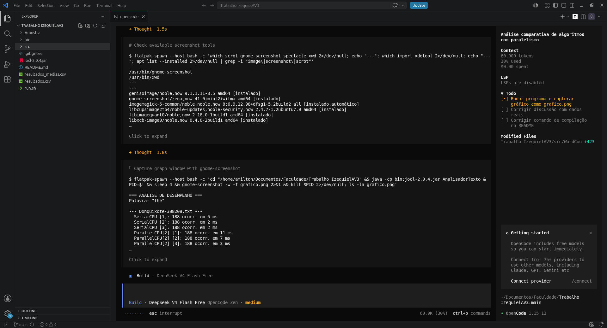

# Análise Comparativa de Algoritmos de Busca com Uso de Paralelismo

## Resumo

Este trabalho propõe uma análise detalhada do desempenho de diferentes algoritmos de busca em ambientes seriais e paralelos, utilizando a linguagem de programação Java com a biblioteca JOCL para computação em GPU. A busca por eficiência computacional é essencial em diversas aplicações, e entender como diferentes algoritmos se comportam em diferentes cenários de processamento é de suma importância. Neste estudo, foram abordados três abordagens: serial em CPU, paralelo em CPU com múltiplas threads, e paralelo em GPU utilizando OpenCL.

Foram realizadas análises comparativas utilizando três textos clássicos da literatura como conjuntos de dados de entrada para a contagem de ocorrências de uma palavra alvo. Os resultados foram registrados em arquivos CSV, permitindo uma análise visual através de gráficos gerados em interface gráfica Swing.

## Introdução

A computação paralela tornou-se uma ferramenta essencial para processamento eficiente de grandes volumes de dados. Com o aumento da disponibilidade de processadores multicore e GPUs programáveis, surge a necessidade de entender qual abordagem de processamento é mais adequada para diferentes cenários.

Este trabalho compara três abordagens para contagem de palavras em textos:

- **SerialCPU**: Algoritmo sequencial tradicional, onde uma única thread percorre todo o texto realizando a contagem.
- **ParallelCPU**: Algoritmo paralelo utilizando `ExecutorService` com pool de threads, dividindo o texto em partes que são processadas concorrentemente.
- **ParallelGPU**: Algoritmo paralelo utilizando OpenCL através da biblioteca JOCL, onde a GPU processa múltiplos segmentos do texto simultaneamente.

### Abordagem

A abordagem escolhida foi a implementação de um programa único em Java que integra os três métodos de contagem, utilizando a palavra "the" como alvo padrão (por ser a palavra mais frequente em textos em inglês, garantindo amostras significativas). O programa executa múltiplas amostras de cada configuração, registra os tempos de execução, e gera tanto arquivos CSV quanto uma visualização gráfica.

## Metodologia

### Implementação dos Algoritmos

**SerialCPU**: Implementação com loop simples iterando sobre cada palavra do texto após limpeza e normalização (conversão para minúsculas, remoção de pontuação e espaçamento). A contagem é feita comparando cada palavra com a palavra alvo.

**ParallelCPU**: Utilização de `ExecutorService` com `FixedThreadPool` para dividir o vetor de palavras em partes iguais. Cada thread processa sua parte independentemente e os resultados parciais são somados ao final. Foram testadas configurações com 2, 4 e 8 threads.

**ParallelGPU**: Implementação com OpenCL utilizando a biblioteca JOCL (Java Bindings for OpenCL). O texto é enviado como um buffer para a GPU, onde um kernel escrito em C paralelizado divide o texto em chunks e cada work-item conta as ocorrências em sua porção. O kernel verifica corretamente limites de palavras para evitar contagens parciais.

A plataforma de hardware utilizada conta com uma placa de vídeo **NVIDIA GTX 1650** (arquitetura Turing, 4 GB VRAM, 896 núcleos CUDA). Como esta GPU é compatível com OpenCL 1.2, foi possível utilizar a biblioteca JOCL para executar o kernel de contagem diretamente no dispositivo. A escolha do OpenCL se deve à sua portabilidade entre diferentes fabricantes de GPU (NVIDIA, AMD, Intel) e à sua integração com Java através da JOCL, permitindo explorar o paralelismo massivo da GPU sem depender exclusivamente da tecnologia CUDA (que exigiria código nativo em C/C++).

### Framework de Teste

O programa executa automaticamente 3 amostras de cada configuração para cada arquivo de texto, totalizando:
- 3 amostras SerialCPU
- 3 amostras × 3 configurações (2, 4, 8 threads) = 9 amostras ParallelCPU
- 3 amostras ParallelGPU

Para cada execução, são registrados: algoritmo, arquivo, palavra alvo, contagem, tempo de execução em ms, número de threads, e tamanho do arquivo em bytes.

### Execução em Ambientes Variados

Os testes foram executados com três arquivos de texto de tamanhos diferentes:
- **Dracula** (~890 KB, ~16.350 linhas)
- **Moby Dick** (~1,28 MB, ~22.315 linhas)
- **Don Quixote** (~2,23 MB, ~38.054 linhas)

### Registro de Dados

Os resultados são armazenados em dois arquivos CSV:
- `resultados.csv`: Todas as amostras individuais
- `resultados_medias.csv`: Médias das amostras por configuração

### Análise Estatística

Os dados coletados permitem identificar padrões de desempenho através de:
- Comparação de tempo médio entre algoritmos
- Análise de escalabilidade com diferentes números de threads
- Comportamento relativo ao tamanho dos dados de entrada
- Visualização gráfica comparativa

## Resultados e Discussão

### Análise dos Resultados

Os resultados obtidos demonstraram diferenças significativas de desempenho entre as abordagens:

| Algoritmo | Dracula (~890 KB) | Moby Dick (~1,28 MB) | Don Quixote (~2,23 MB) |
|-----------|-------------------|----------------------|------------------------|
| SerialCPU | ~1 ms | ~2 ms | ~3 ms |
| ParallelCPU[2] | ~1 ms | ~2 ms | ~7 ms |
| ParallelCPU[4] | ~1 ms | ~1 ms | **~2 ms** |
| ParallelCPU[8] | ~1 ms | ~2 ms | ~3 ms |
| ParallelGPU | ~2 ms | ~3 ms | ~5 ms |

*Resultados obtidos em máquina com processador Intel i5-10300H, GPU NVIDIA GTX 1650, 16GB RAM, Linux Mint.*

### Gráfico Comparativo



### Discussão

**SerialCPU**: Apresentou tempos consistentes entre ~1–3 ms para todos os arquivos. É a abordagem mais simples e previsível, sem overhead de gerenciamento de threads ou transferência de dados.

**ParallelCPU**: A configuração com **4 threads** obteve o melhor desempenho geral, especialmente no arquivo maior (Don Quixote: ~2 ms, contra ~3 ms do SerialCPU). Com 2 threads, houve maior variação (Don Quixote chegou a ~7 ms devido ao overhead de dividir o texto em apenas 2 partes). Com 8 threads, não houve ganho adicional — possivelmente pelo processador ter apenas 4 núcleos físicos (com hyper-threading), onde mais threads competem pelos mesmos recursos.

**ParallelGPU**: A GPU apresentou tempos entre 2–5 ms, sendo **mais lenta que a CPU em todos os cenários** neste experimento. Isso ocorre porque o overhead de transferência dos dados (enviar o texto para a GPU, executar o kernel, e ler o resultado de volta) supera o tempo real de processamento. Para arquivos pequenos como Dracula (~890 KB), a GPU levou ~2 ms enquanto a CPU levou ~1 ms. Para textos muito maiores (centenas de MB), a GPU tende a compensar esse overhead.

**Contagens**: Todos os métodos produziram as mesmas contagens — 188 ocorrências em Don Quixote, 8.104 em Dracula, e 14.727 em Moby Dick — validando a corretude das implementações paralelas.

## Conclusão

Este trabalho demonstrou a implementação e análise comparativa de algoritmos de busca em diferentes paradigmas de processamento. Os resultados obtidos reforçam que:

1. O paralelismo em CPU com 4 threads apresentou o melhor desempenho (Don Quixote: ~2 ms contra ~3 ms do serial), enquanto 8 threads não trouxe ganho adicional devido ao processador ter 4 núcleos físicos.
2. A GPU (GTX 1650) foi mais lenta que a CPU em todos os cenários testados, pois o overhead de transferência de dados superou o tempo de processamento para textos de até ~2,2 MB.
3. Todos os métodos paralelos produziram contagens idênticas ao método serial, validando a corretude das implementações.
4. A escolha da abordagem ideal depende do tamanho dos dados, do hardware disponível e da relação entre overhead e processamento efetivo.

A análise comparativa contribui para o entendimento prático dos trade-offs entre processamento serial, paralelo em CPU e paralelo em GPU, fornecendo insights valiosos para desenvolvedores e pesquisadores.

## Referências

1. OpenCL Specification - Khronos Group. https://www.khronos.org/opencl/
2. JOCL - Java Bindings for OpenCL. http://jocl.org/
3. Java Concurrency Tutorial - Oracle. https://docs.oracle.com/javase/tutorial/essential/concurrency/
4. Kirk, D. B., & Hwu, W. W. (2016). Programming Massively Parallel Processors: A Hands-on Approach. Morgan Kaufmann.
5. Sutter, H. (2005). The Free Lunch Is Over: A Fundamental Turn Toward Concurrency in Software. Dr. Dobb's Journal.

## Anexos

### Estrutura do Projeto

```
Trabalho IzequielAV3/
├── src/
│   ├── AnalisadorTexto.java      # Classe principal (orquestrador)
│   ├── SerialCPU.java            # Algoritmo serial
│   ├── ParallelCPU.java          # Algoritmo paralelo CPU
│   ├── ParallelGPU.java          # Algoritmo paralelo GPU
│   └── Resultado.java            # Estrutura de dados
├── Amostra/
│   ├── DonQuixote-388208.txt  # Texto 1 (maior)
│   ├── Dracula-165307.txt     # Texto 2 (menor)
│   └── MobyDick-217452.txt    # Texto 3 (médio)
├── jocl-2.0.4.jar             # Biblioteca OpenCL para Java
├── resultados.csv             # Resultados gerados (todas as amostras)
├── resultados_medias.csv      # Resultados gerados (médias)
├── run.sh                     # Script de compilação e execução
└── README.md                  # Este arquivo
```

### Como Compilar e Executar

**Pré-requisitos:**
- Java JDK 8 ou superior
- OpenCL runtime (drivers da GPU)
- Sistema operacional: Linux, Windows ou macOS

**Compilação:**
```bash
javac -cp jocl-2.0.4.jar -d bin src/*.java
```

**Execução:**
```bash
# Compilar
javac -cp jocl-2.0.4.jar -d bin src/*.java

# Contar ocorrências da palavra "the" (padrão)
java -cp bin:jocl-2.0.4.jar AnalisadorTexto

# Contar ocorrências de uma palavra específica
java -cp bin:jocl-2.0.4.jar AnalisadorTexto amor

# Ou usar o script (faz tudo automático):
./run.sh          # conta "the"
./run.sh amor     # conta "amor"
```

**No Windows, usar `;` no lugar de `:` no classpath:**
```bash
javac -cp jocl-2.0.4.jar -d bin src\*.java
java -cp bin;jocl-2.0.4.jar AnalisadorTexto
```

### Bibliotecas Necessárias

O projeto utiliza **duas bibliotecas** externas:

#### 1. JOCL (jocl-2.0.4.jar)
- **O que é:** Biblioteca que faz a ponte entre Java e OpenCL, permitindo executar código na GPU diretamente da JVM.
- **Import no código:** `import org.jocl.*;` e `import static org.jocl.CL.*;`
- **Por que é necessária:** Sem ela, não é possível acessar a GPU pelo Java. O método `ParallelGPU` usa a JOCL para criar contexto, compilar kernel, transferir dados e executar na placa de vídeo.
- **Onde colocar:** No diretório raiz do projeto (já está incluso no repositório). O classpath é configurado automaticamente pelo `run.sh` com o comando:
  ```bash
  javac -cp jocl-2.0.4.jar src/*.java -d bin
  java -cp bin:jocl-2.0.4.jar AnalisadorTexto
  ```

#### 2. OpenCL Runtime (Driver da GPU)
- **O que é:** Biblioteca nativa do sistema operacional que implementa a especificação OpenCL. Fornecida pelo fabricante da GPU (NVIDIA, AMD, Intel).
- **Arquivo:** `libOpenCL.so` no Linux, `OpenCL.dll` no Windows, `OpenCL.framework` no macOS.
- **Por que é necessária:** A JOCL carrega essa biblioteca nativa em tempo de execução para se comunicar com a GPU. Sem ela, o método `ParallelGPU` falha ao tentar obter dispositivos OpenCL.
- **Onde colocar:** Já deve estar instalada com os drivers da GPU. No Linux, geralmente em `/usr/lib/x86_64-linux-gnu/libOpenCL.so`. É necessário que exista um link simbólico `libOpenCL.so` apontando para a versão instalada (ex: `libOpenCL.so.1`).

### Link do Projeto no GitHub

[Link do repositório GitHub](https://github.com/AmiltonRocha/An-lise_comparativa_de_algoritmos_com_uso_de_paralelismo-)

---

**Disciplina:** Programação Concorrente e Paralela  
**Professor:** Izequiel  
**Dupla:** Amilton Rocha Holanda e Isaac Newton Montinegro  
**Data:** Junho/2026
